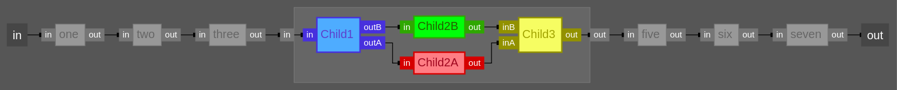
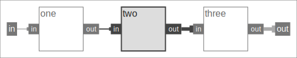

# HDElk

HDElk is a web-based HDL diagramming tool. It was designed to permit the easy visual representation of Verilog or VHDL (generically HDL’s, Hardware Description Languages) in web pages by creation of simple javascript specification objects.

The HDElk [website](https://davidthings.github.io/hdelk/) has an Overview, Installation Instructions and a Tutorial

## Simple Example

Here's a simple diagram




And here's the code that would generate it on a web page

``` HTML
<script src="/js/elk.bundled.js"></script>
<script src="/js/svg.min.js"></script>
<script src="/js/hdelk.js"></script>

<script type="text/javascript">

    var simple_graph = {
        id: "",
        children: [
            { id: "in", port: 1 },
            { id: "one", ports: ["in", "out"] },
            { id: "two", highlight:1, ports: ["in", "out"] },
            { id: "three", ports: ["in", "out"] },
            { id: "out", port: 1 }
        ],
        edges: [
            ["in","one.in"],
            {route:["one.out","two.in"],highlight:1},
            {route:["two.out","three.in"],highlight:1,bus:1},
            {route:["three.out","out"], bus:1 }
        ]
    }

    hdelk.layout( simple_graph, "simple_diagram" );
</script>

<div id="simple_diagram"></div>
```

## Use

Grab the three js files.

Insert the above into an HTML file.

Browse to it.

See the [example.html](example.html) file